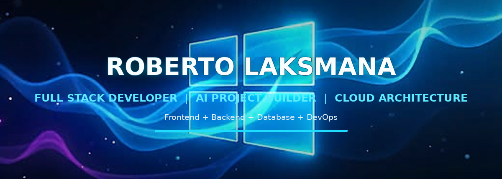
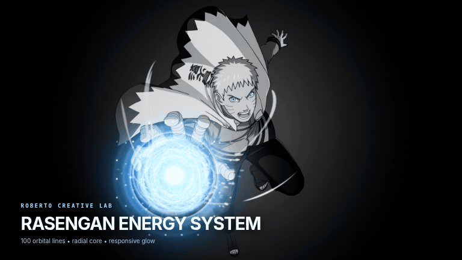

<div align="center">



<br />


<br />

<p>
  
  
  
  
</p>

**Full Stack Developer | AI Project Builder | Cloud Architecture Portfolio**

Frontend + Backend + Database + DevOps

I build deploy-ready web apps, AI-powered features, cloud architecture demos, data workflows, and portfolio-grade engineering systems.

[GitHub Profile](https://github.com/yirassssindaba-coder) | [Portfolio](https://original-ultimate-portfolio.pages.dev/) | [Creative Lab](https://chromatic-website.pages.dev)

</div>

---

## 🌀 Naruto Rasengan

<div align="center">



### Feel this completed Rasengan!

</div>

---

## 🧠 Engineering Identity

I am a Full Stack Developer focused on building practical, reviewable, and deployable systems.

My work combines web applications, APIs, databases, DevOps workflows, Cloudflare deployment, AI features, documentation, and architecture thinking.

I do not only build interfaces. I build the full engineering path:

```txt
Idea → UI → Backend → Database → Automation → Deployment → Documentation → Portfolio Proof
```

---

## ⚡ Current Focus

| Area | What I Build |
|---|---|
| 🧩 Full Stack Apps | React, TypeScript, Vite, Express, APIs, dashboards, forms, and auth-ready UI |
| ☁️ Cloud Architecture | Cloudflare Pages, Workers, D1, KV, AWS reference architecture, CI/CD, PWA |
| 🤖 AI Features | RAG, document search, OCR, adaptive logic, prompt testing, automation workflows |
| 📊 Data & Analytics | KPI dashboards, charts, data pipelines, reports, CSV/JSON export |
| 🛠️ DevOps | GitHub Actions, PWA install, service workers, deployment guides, monitoring concepts |
| 📚 Documentation | README, architecture notes, deployment guide, project proof, portfolio storytelling |

---

## 🌟 Featured Portfolio

| Project | Live | Core Strength |
|---|---:|---|
| 🪨📄✂️ Rock Paper Scissors | Open | Markov-style adaptive logic, match history, stats, PWA |
| 🎮 RPG Game Adventure | Open | Phaser 2D RPG, mobile controls, sprites, quest and battle UI |
| 🐍 Python Compiler | Open | Pyodide, WebAssembly, browser compiler, PWA |
| 🦀 Rust Compiler | Open | Rust runner UI, templates, Compiler Explorer/Piston bridge |
| 🌿 Azka Garden | Open | Plant store, API knowledge reader, checkout-ready portal |
| 🛒 E-Commerce Analysis | Open | KPI dashboard, Recharts/D3/Plotly, analytics workflow |
| 🔗 URL Shortener Website | Open | D1 URL shortener, CRUD, analytics, campaigns, exports |
| 🛠️ IT Support Website | Open | IT superapp, helpdesk SLA, D1/KV console, reports |

---

## 🏗️ Architecture Portfolio Map

| Domain | Portfolio Direction |
|---|---|
| Cloud Architecture | Multi-tier app, VPC, load balancer, autoscaling, monitoring, cost, high availability, disaster recovery |
| Artificial Intelligence | LLM chatbot, RAG, document search, AI agent, OCR, recommendation, forecasting |
| Machine Learning | Classification, regression, clustering, time series, experiment tracking, MLOps |
| Data Engineering | Airflow, dbt, Delta Lake, Kafka, Spark, BigQuery, Snowflake-style pipelines |
| DevOps | GitHub Actions, Docker, Kubernetes, Helm, Argo CD, Prometheus, Grafana, Loki |
| Security | IAM, RBAC, Zero Trust, Vault, SIEM, security scanning, compliance dashboard |
| Backend | REST API, GraphQL, gRPC, authentication, OAuth2, JWT, API gateway, microservices |
| Frontend | React, Next.js, Vue, dashboards, analytics, realtime charts, responsive UI, PWA |
| Database | PostgreSQL, MySQL, MongoDB, Redis, Elasticsearch, Milvus, Weaviate |
| AI Cloud | Bedrock, Vertex AI, Azure AI, SageMaker, Cloud Run, Functions, Lambda concepts |
| Enterprise Architecture | UML, C4, sequence diagram, deployment diagram, ADR, threat modeling |

---

## 🧰 Tech Stack

<div align="center">

### Frontend


### Backend, Data, and Cloud


### DevOps and Architecture


</div>

---

## 🧪 Proof-Oriented Portfolio Standard

Every serious project should show:

- ✅ Clear README
- ✅ Live deployment
- ✅ Screenshots or preview
- ✅ Architecture diagram
- ✅ Stack explanation
- ✅ Install/deploy guide
- ✅ Benchmark or result notes
- ✅ Cost, security, and monitoring consideration
- ✅ Future improvement plan

---

## ☁️ Deployment Standard

Most portfolio projects are designed to be deployable with a simple static-first workflow:

```txt
Project folder
      ↓
Static assets / frontend build
      ↓
Cloudflare Pages Direct Upload
      ↓
Live URL
      ↓
README proof + screenshots + architecture notes
```

Recommended Cloudflare-ready structure:

```txt
.
├── index.html
├── assets/
├── icons/
├── manifest.webmanifest
├── sw.js
├── offline.html
├── _headers
├── _redirects
├── README.md
└── LICENSE
```

---

## 📱 PWA Standard

For installable portfolio projects, I prefer:

- `manifest.webmanifest`
- app icons for mobile and desktop
- service worker registration
- offline fallback page
- responsive layout
- clear install behavior
- cache strategy that does not break future updates

---

## 🔐 Security Mindset

I design projects with practical engineering boundaries:

- no exposed API keys;
- no committed secrets;
- least-privilege access;
- safe fallback mode for demos;
- clear separation between frontend and backend logic;
- validation for user input;
- clear notes for production limitations;
- deployment documentation before public release.

---

## 🧭 Roadmap

```txt
2026 → Stronger cloud architecture portfolio
2026 → AI/RAG/document-search projects
2026 → Data engineering + dashboard proof
2026 → DevOps, monitoring, security, and enterprise architecture documentation
2026 → AI Solutions Architect readiness
```

---

## 📌 Repository Description

```txt
🚀 Full Stack Developer | AI Project Builder | Cloud Architecture portfolio: web, cloud, data, DevOps, and deploy-ready apps. ✨⚡🔥!!
```

---

## 📚 Useful References

- [Cloudflare Pages documentation](https://developers.cloudflare.com/pages/)
- [Cloudflare Pages Direct Upload](https://developers.cloudflare.com/pages/get-started/direct-upload/)
- [MDN Progressive Web Apps](https://developer.mozilla.org/en-US/docs/Web/Progressive_web_apps)
- [MDN Web App Manifest](https://developer.mozilla.org/en-US/docs/Web/Progressive_web_apps/Manifest)
- [Shields.io badges](https://shields.io/)

---

## 🤝 Connect

- GitHub: https://github.com/yirassssindaba-coder
- Portfolio: https://original-ultimate-portfolio.pages.dev/
- Creative Lab: https://chromatic-website.pages.dev
- Resume: Google Drive

<div align="center">

### “Build proof, not just claims.”

</div>
