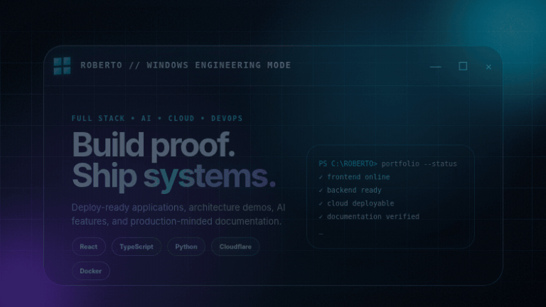

<div align="center">

<picture>
  <source media="(prefers-reduced-motion: reduce)" srcset="./assets/windows-roberto-samurai.jpg" />
  
</picture>

<br />


<br />

<p>
  <a href="https://complete-app-website.pages.dev"></a>
  <a href="https://chromatic-website.pages.dev"></a>
  <a href="https://github.com/yirassssindaba-coder"></a>
</p>

# Roberto Ocaviantyo Tahta Laksmana

**Full Stack Developer · AI Project Builder · Cloud Architecture Portfolio**

Frontend + Backend + Database + DevOps

I build deploy-ready web applications, AI-powered features, cloud architecture demos, data workflows, and portfolio-grade engineering systems.

[Portfolio](https://complete-app-website.pages.dev) · [Ultimate Portfolio](https://original-ultimate-portfolio-website.pages.dev) · [Creative Lab](https://chromatic-website.pages.dev) · [GitHub](https://github.com/yirassssindaba-coder)

</div>

---

## Navigation

[Engineering Identity](#-engineering-identity) · [Windows Experience](#-windows-creative-systems) · [Rasengan Lab](#-rasengan-energy-lab) · [Featured Work](#-featured-portfolio) · [Architecture](#-architecture-portfolio-map) · [Stack](#-tech-stack) · [Standards](#-proof-oriented-portfolio-standard) · [Roadmap](#-roadmap) · [Connect](#-connect)

---

## 🧠 Engineering Identity

I am a Full Stack Developer focused on building practical, reviewable, and deployable systems. My work combines product UI, APIs, databases, automation, cloud deployment, AI features, documentation, and architecture thinking.

```text
Idea → UX → Frontend → Backend → Database → Automation → Deployment → Documentation → Proof
```

### Current focus

| Area | What I Build |
|---|---|
| 🧩 Full Stack Apps | React, TypeScript, Vite, Next.js, Vue, APIs, dashboards, forms, auth-ready interfaces |
| ☁️ Cloud Architecture | Cloudflare Pages, Workers, D1, KV, AWS reference architecture, CI/CD, PWA |
| 🤖 AI Features | RAG, document search, OCR, adaptive logic, prompt testing, agents, automation workflows |
| 📊 Data & Analytics | KPI dashboards, charts, data pipelines, reporting, CSV/JSON export |
| 🛠️ DevOps | GitHub Actions, Docker, Kubernetes, service workers, monitoring concepts, deployment guides |
| 📚 Documentation | README, architecture notes, runbooks, benchmark notes, cost/security decisions |

---

## 🪟 Windows Creative Systems

<picture>
  <source media="(prefers-reduced-motion: reduce)" srcset="./assets/windows-roberto-samurai.jpg" />
  
</picture>

The Windows presentation layer uses a cinematic samurai transition instead of a passive screenshot. The sequence includes a moving CSS samurai, four directional blade streaks, a short impact flash, segmented screen pieces, and a final engineering reveal.

| Property | Implementation |
|---|---|
| Rendering | Semantic HTML + CSS keyframes; no animation framework required |
| Visual language | Windows-inspired glass panel, terminal status, cyan/violet engineering glow |
| Motion sequence | Samurai pass → four slashes → impact flash → segmented break → title reveal |
| Responsive behavior | Fluid viewport units and a mobile layout breakpoint |
| Accessibility | Static JPEG fallback and `prefers-reduced-motion` support |
| Source | [`demos/windows-samurai`](./demos/windows-samurai) |

> The animated preview is a GIF because GitHub README pages do not execute arbitrary project CSS or JavaScript. The full browser-native animation lives in the demo directory.

---

## 🌀 Rasengan Energy Lab

<picture>
  <source media="(prefers-reduced-motion: reduce)" srcset="./assets/rasengan-roberto-preview.jpg" />
  
</picture>

The supplied artwork is enhanced with the requested Rasengan system: **100 independent orbital lines**, a white-blue radial core, layered halos, sparks, 3D rotation, and a pulsing energy field. The original Sass random loop was converted into deterministic CSS custom properties, so the demo works immediately without a Sass compiler.

```text
100 orbital lines
+ radial-gradient energy core
+ rotateX / rotateY / rotateZ motion
+ layered blue-white bloom
+ responsive positioning
+ reduced-motion fallback
```

| Property | Implementation |
|---|---|
| Core | White → cyan → electric-blue radial gradient |
| Orbit field | 100 circular layers with independent duration, delay, inset, and 3D axis values |
| Energy bloom | Multi-layer box shadows, halos, spark mask, and pulse scaling |
| Integration | Positioned over the Rasengan already present in the supplied image |
| Source | [`demos/rasengan`](./demos/rasengan) |

---

## 🌟 Featured Portfolio

| Project | Engineering Proof | Core Strength |
|---|---|---|
| 🪨📄✂️ Rock Paper Scissors | PWA, match history, adaptive behavior, statistics | Markov-style adaptive logic |
| 🎮 RPG Game Adventure | Responsive controls, sprites, quests, battle UI | Phaser-based game system |
| 🐍 Python Compiler | Browser execution, offline-ready shell, examples | Pyodide + WebAssembly |
| 🦀 Rust Compiler | Templates, runner UX, service bridge design | Compiler workflow and resilient UI |
| 🌿 Azka Garden | Catalog, plant knowledge, responsive commerce flow | Product storytelling and WebGL-ready visuals |
| 🛒 E-Commerce Analysis | KPI cards, charts, filters, exports | Analytics workflow |
| 🔗 URL Shortener | CRUD, campaigns, analytics, exports | Cloudflare D1-ready architecture |
| 🛠️ IT Support Platform | Helpdesk flow, SLA, reports, operational console | Enterprise service workflow |

---

## 🏗️ Architecture Portfolio Map

| Domain | Portfolio Direction |
|---|---|
| Cloud Architecture | Multi-tier applications, VPC, load balancing, autoscaling, HA, DR, monitoring, cost optimization |
| Artificial Intelligence | LLM chatbot, RAG, document search, agents, OCR, recommendation, forecasting |
| Machine Learning | Classification, regression, clustering, time series, experiments, MLOps |
| Data Engineering | Airflow, dbt, Delta Lake, Kafka, Spark, BigQuery, warehouse-style pipelines |
| DevOps | GitHub Actions, Docker, Kubernetes, Helm, Argo CD, Prometheus, Grafana, Loki |
| Security | IAM, RBAC, Zero Trust, Vault, SIEM, scanning, compliance dashboards |
| Backend | REST, GraphQL, gRPC, OAuth2, JWT, API gateway, microservices |
| Frontend | React, Next.js, Vue, realtime dashboards, responsive UI, PWA |
| Database | PostgreSQL, MySQL, MongoDB, Redis, Elasticsearch, Milvus, Weaviate |
| AI Cloud | Bedrock, Vertex AI, Azure AI, SageMaker, Cloud Run, Functions, Lambda concepts |
| Enterprise Architecture | UML, C4, sequence/deployment diagrams, ADR, threat modeling |

---

## 🧰 Tech Stack

<div align="center">

### Frontend


### Backend, Data, and Cloud


### DevOps and Architecture


</div>

---

## 🧪 Proof-Oriented Portfolio Standard

Every serious project should demonstrate:

- ✅ a clear problem statement and README;
- ✅ a live deployment or reproducible local run;
- ✅ screenshots, GIFs, or a concise video demo;
- ✅ an architecture diagram and stack explanation;
- ✅ installation, build, and deployment instructions;
- ✅ benchmark, validation, or result notes;
- ✅ security, cost, monitoring, and production-limit considerations;
- ✅ a focused improvement roadmap.

### Cloudflare-ready static structure

```text
.
├── index.html
├── assets/
├── icons/
├── manifest.webmanifest
├── sw.js
├── offline.html
├── _headers
├── _redirects
├── README.md
└── LICENSE
```

### Deployment path

```text
Source → Validate → Build → Static output → Cloudflare Pages → Live proof → Documentation
```

---

## 📱 PWA and Security Baseline

| PWA | Security |
|---|---|
| Installable manifest and correct icons | No exposed API keys or committed secrets |
| Service worker with update-safe caching | Least-privilege access and safe demo fallbacks |
| Offline fallback and responsive layout | Input validation and frontend/backend separation |
| Clear install behavior on mobile and desktop | Explicit production limitations and deployment notes |

---

## 🧭 Roadmap

```text
2026 → Stronger cloud architecture portfolio
2026 → AI, RAG, and document-search systems
2026 → Data engineering and analytics proof
2026 → DevOps, observability, security, and enterprise architecture documentation
2026 → AI Solutions Architect readiness
```

---

## 📁 Animation Source Layout

```text
.
├── README.md
├── assets/
│   ├── windows-roberto-samurai.gif
│   ├── windows-roberto-samurai.jpg
│   ├── rasengan-roberto-preview.gif
│   ├── rasengan-roberto-preview.jpg
│   └── rasengan-source.png
├── demos/
│   ├── windows-samurai/
│   │   ├── index.html
│   │   └── style.css
│   └── rasengan/
│       ├── index.html
│       └── style.css
└── src/
    ├── samurai-source-notes.txt
    └── rasengan-source-notes.txt
```

Open either demo locally or publish the directory through GitHub Pages or Cloudflare Pages to run the browser-native CSS animations.

---

## 🙏 Credits and Usage Notes

- Samurai animation concept adapted from **CSS Samurai Animation** by Deepak K Vijayan on CodePen.
- Rasengan orbital concept adapted from **Pure CSS Rasengan** by Harry Xie on CodePen.
- The Rasengan artwork in this package was supplied for this project. Confirm that you hold the necessary rights before public or commercial publication.
- Review the original creators’ licensing and attribution requirements before redistributing derivative code.

---

## 🤝 Connect

- GitHub: <https://github.com/yirassssindaba-coder>
- Portfolio: <https://complete-app-website.pages.dev>
- Ultimate Portfolio: <https://original-ultimate-portfolio-website.pages.dev>
- Creative Lab: <https://chromatic-website.pages.dev>
- Resume: Google Drive

<div align="center">

### “Build proof, not just claims.”

</div>
